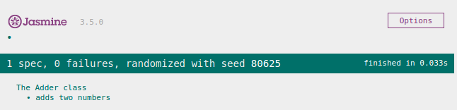
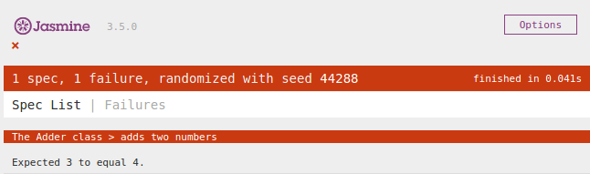

When we buy a chair, bike or car, we are buying products that undergo a fair amount of industrial testing. For example, before it goes out to the market, a car must go through a series of tests for resistance, security, impact absorption, etc.

Software is not an exception. Buggy code can cause serious problems like loosing or corrupting important data, security vulnerabilities, servers going down, slow running programs that use a lot of resources, etc.

Sometimes software bugs can have fatal consequences, like in the case of flight crashes or the [Therac-25](https://en.wikipedia.org/wiki/Therac-25), a cancer treatment device that killed several patients because an bug in the code caused them to receive 100 times more radiation than the dose prescribed by their doctors.

<figure>
  
  <figcaption>Testing is important in several industries.</figcaption>
</figure>

### What is automatic testing?

We could manually test our code by running our application. However, we would need to keep an updated list of all the specific cases and all the things that our app can do, and make sure that we don't forget any. Doing this everytime we make a little change is tedious.

**Automatic testing** is writing extra code that does that for us. It runs parts of our application, passing them different values and checking that it behaves how we expect and that all operations return the right result. We can run this testing code as many times as we want and it will exercise all the specific cases that our app supports.

For example, if we have a class with a function that adds two numbers:

```js
class Adder {
  add(a, b) {
    return a + b;
  }
}
```

We could test it like this:

```js
describe('The Adder class', function() {
  it('adds two numbers', function() {
    let adder = new Adder();
    expect(adder.add(2, 1)).toEqual(3);
  });
});
```

This test uses [a testing framework called Jasmine](https://jasmine.github.io/index.html), which is very similar to [Ruby's testing framework RSpec](https://rspec.info/) and reads pretty much like English.

* the `describe` word defines a block of tests that describe the behaviour of the class we are testing. We can provide it with a text description, in this case `'The Adder class'`. The text description will be printed everytime we run the tests and will be concatenated with the text description of each individual test, forming a full sentence that is very helpful to know which tests have run.

* the `it` word defines a single test. We can provide it with a description, in this case `'adds two numbers'`.

* Inside the test we have the `expect` word, which defines an "expectation". We expect that when we call our function with two parameters, 2 and 1, the result has to be 3.

* When we run this test, it can pass or it can fail. If it passes, we say we have a "green" test, and we will get a printout like this, where the description of the test is usually displayed in green text:

<figure>
  
  <figcaption>When tests pass they are green.</figcaption>
</figure>

* If it fails, we say we have a "red" test, and we will get a printout like this, where the description of the test is usually displayed in red text:

<figure>
  
  <figcaption>When tests fail they are red.</figcaption>
</figure>

### Anatomy of a test

Tests are usually divided in three parts:

* **Setup:** this is where we create all the context needed for the test. We instantiate objects, we read files, etc. In the previous example, this line represents the setup:

```js
let adder = new Adder();
```

* **Run the code:** this is the part when we actually run our code. In the previous example, this is where we run the code:

```js
adder.add(2, 1)
```

* **Check the result:** this is the part where we set up the expectations, where we compare what our code returns with what we expect it to return. In the previous example, this is the expectation:

```js
expect(/*result of running the code*/).toEqual(3)
```

Sometimes this is called "**the three As: Arrange, Act, Assert**".

### TDD

TDD means **Test Driven Development**. This is when we write our test first, and then we write the code to make the test pass. This has a lot of benefits:

* To begin with, it allows us to write our code in tiny bits and check constantly that we are not breaking anything, rather than writing a bunch of code and then playing bug hunting until the Sun dies.
* All our code ends up tested. This means we have 100% test coverage.
* Our code has a better design, it is cleaner
* Our code is less coupled and dependencies are better managed
* Our code is more efficient, because you are more focused, you write more modular code
* Our code is easier to test
* We don't write more code than needed
* We can think of the interface we want, the method signature, and what we want to return

TDD has 3 stages:

**Red:** we first write a test, we run it, it's red because we don't have any code yet.

**Green:** we write the simplest possible code that makes the test green, sometimes called "the shameless green" because we are only focused in making the test pass.

**Refactor:** with the test in place, it's time to improve the design of the code without changing it's behaviour.

<figure>
  
  <figcaption>The red-green-refactor cycle.</figcaption>
</figure>

<!-- Ideally you want your tests to be fast, so that you can run them very often. -->

 <!-- For this they should not depend on any external system, which is why  -->

### Other benefits of testing

* Less buggy code
* Less coupled code
* Testing tiny bits of the app in isolation rather than having to run the entire app
* Tests document what your code can do and how to use it
* You can refactor safely and if you break the code the tests will tell you immediately

### To do

* Read through [the Jasmine annotated documentation](https://jasmine.github.io/tutorials/your_first_suite) and try to understand what you can do with it.

* Go to [the Jasmine downloads page](https://github.com/jasmine/jasmine/releases) and download the jasmine standalone zip file. Examine the contents. Can you figure out how you are supposed to use it?

* Do the pair programming kata: Roman numerals.

* Add tests to the login challenge (first rewrite it with classes). Did it feel tedious to add tests after the code, compared to your experience with the kata?

* Add tests to the rock paper scissors challenge and to the address book challenge (first rewrite them with classes)

* From now on build all your projects with TDD.
