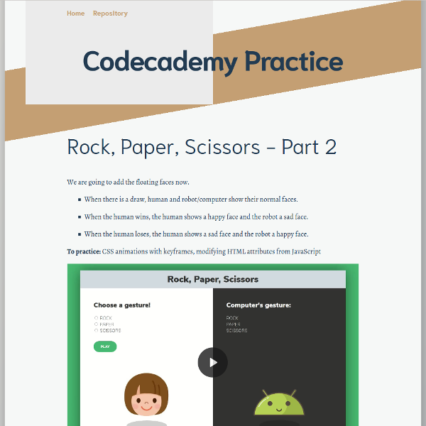

# Codecademy Practice
This repo contains exercises and challenges to practice the lessons learned in [the Javascript course at Codecademy](https://www.codecademy.com/learn/introduction-to-javascript).



## Running

This is a Jekyll site, so you can run it with:

```
bundle exec jekyll serve
```

and then go to http://localhost:4000.

## Contributing

Contributions are welcome, to add more challenges or improve the current ones. Feel free to fork this repository and send me a pull request.

Look around at the code and follow the conventions.

In some cases videos may help show the final result. If you do a video, keep it below 1 Mb, and use a format that is playable in all browsers. There is a script in this repository to convert mp4 videos to an mp4 format that Firefox can reproduce. Use it like this:

```sh
. convertvideo.sh path/to/video.mp4
```

This will produce an mp4 version of the video that is playable by Firefox.
