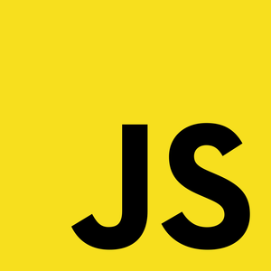

This repository contains exercises and challenges to practice the languages listed below. It's aimed at beginners.

  <a href="javascript">
    
    JavaScript
  </a>
  <a href="ruby">
    
    Ruby
  </a>
  <a href="resources">
    
    Resources
  </a>

