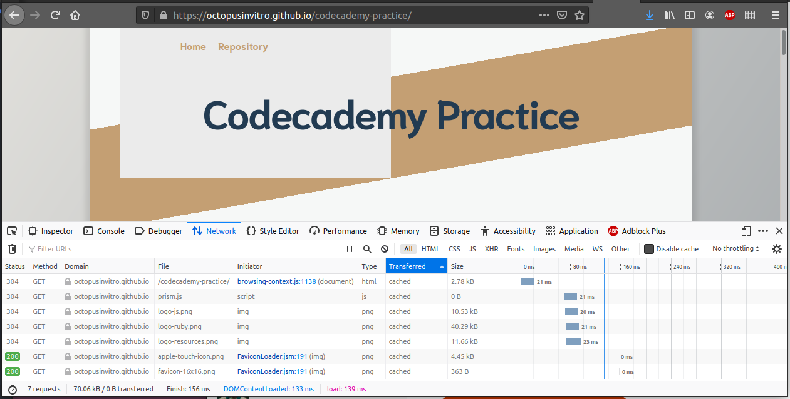
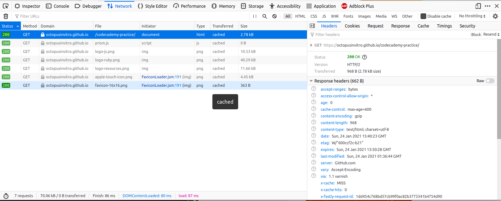

**Challenge:** We are going to create a script that can retrieve information about a specified GitHub user using the GitHub API.

**HTTP Requests**

What are HTTP Requests?

Every time the browser fetches data from a server (which could be a page, an image, a script, etc.) it does it using HTTP. HTTP is the **H**​yper**T**ext **T**​ransport **P**​rotocol. The server then sends back a **response**. An API is an easy way of fetching information from a remote service, in a way that's easy for a computer to understand.

GitHub offers a simple API for viewing its current and historical server availability.

> Availability means whether or not the GitHub website was accessible to users and accepting traffic. If your website is down, it is not available.

You can access an API in your web browser. Just type the following into the address bar:

<https://www.githubstatus.com/api/v2/summary.json>

If you are on a mac or a Linux/UNIX machine, you can access the API using `curl`:

```plaintext
curl https://www.githubstatus.com/api/v2/summary.json
```

Here is an example of the **GET** requests issued by this site. You can view any requests issued by a website by going to the Network tab in the developer tools of your browser.

<figure>
  
  <figcaption>The network tab shows information for every resource that was requested, including its HTTP status code, HTTP method, type, size, and time it spent in each request phase.</figcaption>
</figure>

As part of the response, a request gives back a status code. You can use this to identify if the request was successful or not.

<table class="es-table">
  <caption>Some examples of status codes</caption>
  <thead>
    <tr>
      <th>Status code - message</th>
      <th>Description</th>
    </tr>
  </thead>

  <tbody>
    <tr>
      <td><p style="padding-left:1em">200 - OK</p></td>
      <td><p style="padding-left:1em">Successful request</p></td>
    </tr>
    <tr>
      <td><p style="padding-left:1em">304 - Not modified</p></td>
      <td><p style="padding-left:1em">The page has not been modified since we last retrieved data</p></td>
    </tr>
    <tr>
      <td><p style="padding-left:1em">400 - Bad Request</p></td>
      <td><p style="padding-left:1em">The server did not understand the request</p></td>
    </tr>
    <tr>
      <td><p style="padding-left:1em">404 - Not Found</p></td>
      <td><p style="padding-left:1em">The server could not find the requested resource</p></td>
    </tr>
  </tbody>
</table>

**HTTP Verbs**

HTTP verbs are sent by the browser or client, and along with the URL used and data transmitted form part of the instruction to the API. There are several verbs, but in this tutorial we will be primarily using **GET**. **GET** is used to fetch information from an API. Another common verb is **POST**, which is used to create a new object on the remote service.

**HTTP Headers**

HTTP headers are metadata about the request that can be used by the server to obtain information about the request. You can see the headers of a resource if you click on it in the network tab of your browser's developer tools.


<figure>
  
  <figcaption>If you click on any resource in the network tab, you can see information about the request for that resource, for example the headers.</figcaption>
</figure>


**More information about HTTP:** Follow the [HTTP tutorial](https://www.tutorialspoint.com/http/index.htm), in particular the methods, status codes and header fields.

**To practice:** The HTTP protocol, APIs, JSON, Loading API data into your application.


### Step by step instructions:

We'll build a small application that gives us back information about a GitHub user - we want to show their username, information and their picture.

GitHub offers an API where you can request information for a given username. The verb to use is **GET**, and the url is <https://api.github.com/users/username>. Try replacing `username` with your actual GitHub username. You can simply access this URL in your web **browser** by typing <https://api.github.com/users/username> into the address bar.

Again, to request the same URL in the **terminal**, you can use `curl`:

```plaintext
curl -XGET https://api.github.com/users/username
```

or, as **GET** is the default verb, just:

```plaintext
curl https://api.github.com/users/username
```

The response will look something like the JSON data below (this one is shortened):

```js
{
  "login": "octocat",
  "id": 1,
  "avatar_url": "https://avatars.githubusercontent.com/u/9906?v=2",
  "gravatar_id": "",
  "html_url": "https://github.com/octocat",
  "type": "User",
  "name": "monalisa octocat",
  "company": "GitHub",
  "blog": "https://github.com/blog",
  "location": "San Francisco",
  "email": "octocat@github.com",
  "bio": "There once was...",
}
```

JSON data is what's called key-value pairs, meaning that the name of the field is displayed immediately before the value. As you can see, the URL for the avatar (user's icon) is in the `"avatar_url"` field, and is <https://avatars.githubusercontent.com/u/9906?v=2>.

* In order to do the request, we are going to use the `rest-client` library in Ruby. You can find it in [its dedicated page on the rubygems site](https://rubygems.org/gems/rest-client/versions/1.8.0). Familiarize yourself with the gem by checking the docs and playing with it in pry. How do you make a request? What methods are available in the response object?

* Refresh your memory on how to install gems in your application in the section "**Installing gems**" of [the page about Ruby environments](http://localhost:4000/ruby/installing-the-environment).


#### Testing

When testing HTTP clients, you often need to simulate specific scenarios like returning a successful response, returning an error, or returning specific responses in a certain order. Because unit tests need to be predictable, easy to bootstrap, and fast, hitting an actual remote API is a test smell.

In order to test requests, we have to mock them, that is, intercept the request before it goes online and manually tell it what to return. That way we are in control.

We are going to use the external `webmock` library to mock requests. You can find it in [its dedicated page on the rubygems site](https://rubygems.org/gems/webmock/versions/3.11.0). Familiarize yourself with the gem and how you can use it to capture requests.

> In the WebMock examples, they are not using `rest-client` to make the requests, they are using `net-http`. That is a native-Ruby library that does the same as `rest-client`, but it's less intuitive to use than `rest-client`.

The docs show some testing examples, we can follow any of the examples for testing **GET** requests.

* To stub a request with WebMock, you use the method `stub_request`, and to tell it what to return, you call the method `to_return`, which accepts a hash as an argument.

* The JSON string returned by the request would usually go in the `body` key of that hash. The status code can be set as an integer value in the `status` key .

* When we test requests is good to use **fixtures**. A fixture is a test file that you can use in tests. Usually they are stored in a `fixtures` folder inside of the `spec` folder.

* It's a good idea to download a real-world sample of the JSON returned by the API endpoint you are testing and save it as a `.json` file in the fixtures folder. Then, in tests, you can read the contents of that file as a **string** and pass that string as the value of `body`. That is how we simulate the API sending JSON to us.

* To simulate and test the failure branch of the code you can use WebMock to simulate request errors and then use [the specific RSpec matcher](https://relishapp.com/rspec/rspec-expectations/docs/built-in-matchers/raise-error-matcher).


#### **GET** ting started (🥁)

* Build a CLI app that asks the user for a GitHub username and displays information for that user from the GitHub API

* The app asks first for a username and reads it from the terminal. Valid GitHub usernames follow these patterns:
  * may only contain alphanumeric characters or hyphens.
  * cannot have multiple consecutive hyphens.
  * cannot begin or end with a hyphen.
  * Maximum is 39 characters.

* Then, a request to the GitHub API is done passing the username that was entered.

* Use the `rest-client` gem to make a request, choosing the right verb and using the right URL. In order to ensure our URLs are well formed, we will use the Ruby-native `URI` library. [Check the docs here](https://ruby-doc.org/stdlib-2.7.2/libdoc/uri/rdoc/URI.html) and get familiar with it.


#### Handling a successful request

If the request was successful, the status code will be 200. If we check that this code is 200, we know we can proceed to reading the data.

* Once we've checked the status, if the request was successful, we need to decode the data which is stored in the response object returned by the `rest-client` gem. It's in JSON format, which is a string, so we need to turn that into a native hash object. We do this using `JSON.parse(data)`.

* Parsing JSON can also lead to errors, so be sure to investigate what errors can `parse` throw and handle them.

* Display the user's Github information in the terminal, like this:

```plaintext
<username> is GitHub user #<userid>
Avatar: <avatarurl>
Link to profile: <link>
```

replace `username`, `userid`, `avatarurl` and `link` with the corresponding values.


#### Handling a failed request

We should always handle errors in requests. Check if the library you are using provides any custom errors that you can rescue.

* Make sure to have error handling in place, as a request can go wrong for many reasons: page not found, network down, server timeout, etc.

> Have a look again at the HTTP status codes. There is only one response code for a successfully request, anything else should be classed as a failure.

* Refresh how to handle errors in [this short guide](https://www.rubyguides.com/2019/06/ruby-rescue-exceptions/).

* When we have a failing request, we want to display an error message to the user:

```plaintext
No such user!
```

#### Optional

* Use an HTML user interface rather than a CLI user interface.
