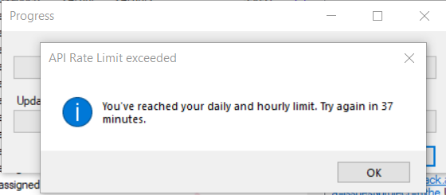

**Challenge:** We are going to create a Sinatra app that will tell you the weather in your city for today.

Often API requests take a bit more resources than reading data from a database. We have to make requests through the internet, a lot of things may go wrong, connections can be slow, etc. While the database may be in the same server where the app is running.

Another issue is that the API may have a request limit, for example, 1000 requests per minute, so when you go make request number 1001, the API returns an error.

<figure>
  
  <figcaption>If you hit some APIs too often, you may get an error. Always use APIs responsibly, in particular if they are free.</figcaption>
</figure>

Because of this, sometimes we may want to prioritize returning data from the database. We could periodically download the full data from the API and save it in our database so we don't hit it more often than need it.

We could also download it as we need it, and save it as we go. This is the approach we will follow here.

The user selects a city from a dropdown, then the app will try to find the weather for today for that city in a SQL database and show it on the page.

If there is no information for today in the database, it will connect to [the Open Weather API](https://openweathermap.org/) to retrieve it, save it in the database for the next user, and then show it on the page.

<figure>
  
  <figcaption>The Open Weather API is free, you just need to create an account and get an API key</figcaption>
</figure>

### Step by step instructions:

#### The Open Weather API

The Open Weather API has several APIs. Use the "current" API, [you can find the docs here](https://openweathermap.org/current). Read through the docs to see all the ways you can retrieve the weather and check out a sample JSON response. From that response, decide which parameters you are going to pick to display.

You need to create an account so that you get an API key that you can use in your requests. Since this is a free API, this is a way to use it in a responsible matter.

See which cities have data available from the API and choose a reduce number, maybe ten.

#### The database

Once you have decided what data is relevant from the response, decide how you want to save it in the database. What name should the table have? How many columns? what are good column names for that data?

#### The Sinatra app

Your user interface is HTML, handled by a Sinatra app. You can print the weather in the page in any format you like. You can use icons if you want and get creative!

Since users may type cities in any format, let the user select the city from a dropdown with the cities you have selected to support. Use the `select` element for that, [check the docs in the MDN site](https://developer.mozilla.org/en-US/docs/Web/HTML/Element/select).

#### To know more

If you want to know more about APIs check out [this video about APIs for beginners](https://www.youtube.com/watch?v=GZvSYJDk-us).
